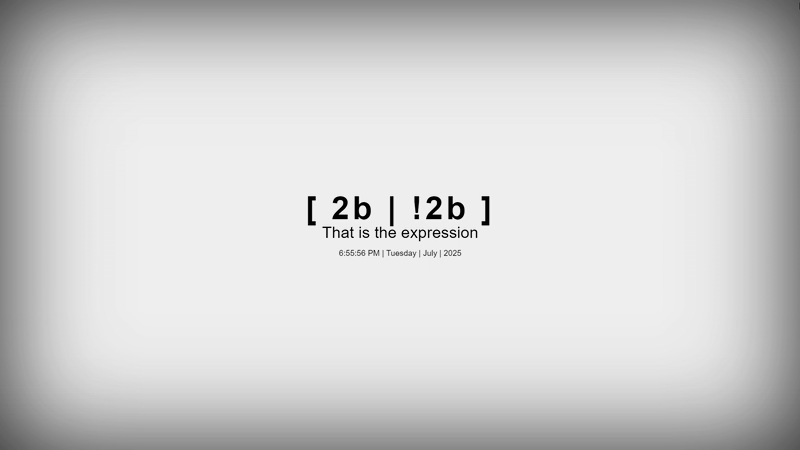
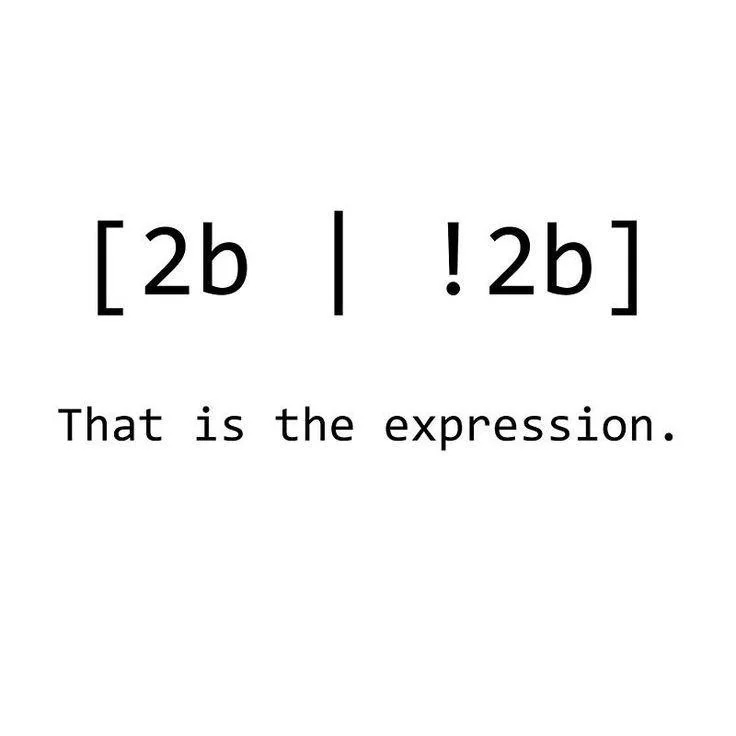
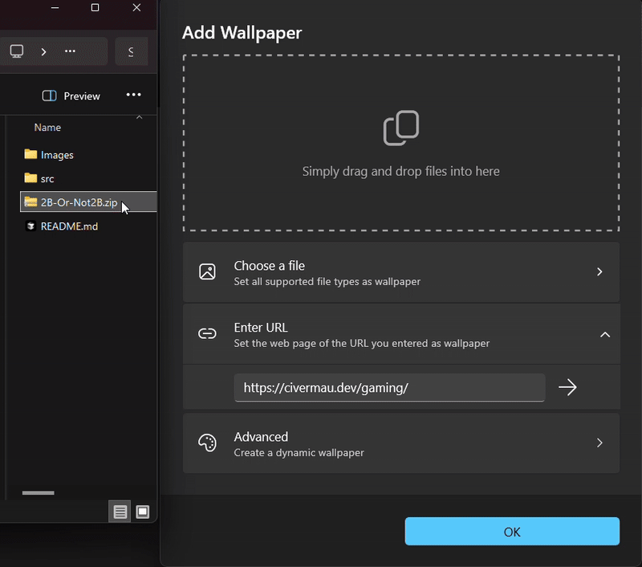

# 🎭 2B-Or-Not2B - Live Wallpaper

*Minimalist wallpaper inspired by another meme I also saw in reddit*

  

## 📋 Overview

So I found that meme and I found it pretty funny how it worked actually pretty well!
So, I've done a wallpaper already so, why not another one? Again, a minimalist wallpaper that offers a little of info to the user

---

## 🚀 Installation + Prerequisites

### Prerequisites
- **[Lively Wallpaper](https://github.com/rocksdanister/lively)** - Free and open-source wallpaper engine
Again, like, it's a very simple wallpaper, if you have a screen and some ram, you can definetively have this wallpaper

### Installation Steps

1. [this zip](2B-Or-Not2B.zip)
2. In Lively, click "Add Wallpaper" (The '+' button)
3. Drag and drop the folder or select it in the file explorer to install

### 🔧 Configuration
It also have a couple customization options, but, I mean, there is not that much you'd like to customize in this one... right?

---

## 🎨 Customization Guide

### Text Elements
- **Main Text**: "[ 2b | !2b ]" - The core programming joke
- **Subtitle**: "That is the expression" - The clever twist on the original quote
- **Date/Time**: Live updating timestamp showing current day, time, and date

### Color Customization
Each text element has independent color control, allowing you to:
- Match your system theme
- Create contrast for better readability
- Express your personal style
- Adapt to different lighting conditions

### Font Size Options
- **Main Text**: 8px to 128px - Make it subtle or bold
- **Subtitle**: 6px to 64px - Fine-tune the supporting text
- **Date/Time**: 6px to 48px - Adjust for perfect readability

---

## 🤝 Editing

Again, if it's on my github, it's because you are free to take it, edit it, break it and fix it, the point is that feel free to learn from it and open a pull request that I'll never see because too lazy to read and approve 

## 📄 License

This project is licensed under the MIT License - see the [LICENSE](../LICENSE) file for details.
Check also [this link](https://creativecommons.org/licenses/by-nc-sa/4.0/)

---

*"[ 2b | !2b ], that is the expression"*

Overdocumenting again with a long-ass readme for now one to read it? Hell yeah

 