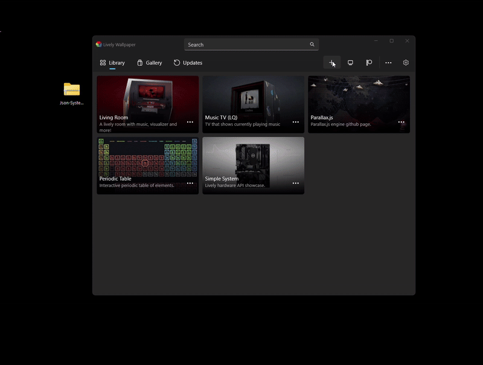

# 🖥️ Json System Stats - Live Wallpaper

*Minimalist JSON-like wallpaper that displays system information and date. Inspired by a meme I saw on reddit*

  

## 📋 Overview

So I wanted a wallpaper, and after seeing a meme in reddit of someone having a json to display information in a smartwatch that made me laugh so hard, I though on making one myself.
And here is it!
A JSON-like wallpaper to display date, time, computer information and even music/videos information!

### ✨ What if offers
- 🎨 **JSON-inspired design** with customizable colors
- 📊 **Real-time system monitoring** (CPU, RAM, Battery, Audio)
- 🎵 **Now playing integration** with system audio
- 🌈 **Very customizable** appearance and data display
- 🔧 **Easy configuration** through Lively Wallpaper settings

---

## 🚀 Installation + Prerequisites

### Prerequisites
- **[Lively Wallpaper](https://github.com/rocksdanister/lively)** - Free and open-source wallpaper engine (ngl, a pretty cool project!)
I mean, that's everything, if your computer can run lively, then it *should* be able to just use the wallpaper

### Installation Steps

Just download [this zip](Json-System-Display.zip)
In lively, click "Add Wallpaper" (The '+' button), and drag and drop (Or select the file in the explorer) to install it

### 🔧 Configuration
Access wallpaper settings by right-clicking the wallpaper in Lively and selecting **"Customize"**, or if you are already using it, in the system tray, right click the Lively icon and select **"Customize"**.

---

## 🎯 Features

### 🎮 Interactive Demonstrations

| 🎬 **Feature Demo** | 📝 **Description** |
|:---:|:---|
|  | **💻 Computer Information Toggle** Show/hide detailed computer specifications including CPU, GPU, motherboard, and system architecture information. |
|  | **🔋 Battery Status Monitoring** Real-time battery percentage, charging status, and power consumption data for laptops and portable devices. |
|  | **🵠System Audio Integration** Display currently playing media with artist, title, and playback controls. Works with Spotify, YouTube, and system audio. |
|  | **📠Adjustable Font Size** Scale the text from 1px to 32px for optimal readability on any screen size. Perfect for high-DPI displays or accessibility needs. |
|  | **📅 Flexible Date Formats** Switch between DD/MM/YYYY and MM/DD/YYYY formats to match your regional preferences. |
|  | **⏰ 12/24 Hour Time Display** Choose between 12-hour (AM/PM) and 24-hour time formats for international compatibility. |
|  | **🧠 Memory Unit Selection** Toggle between MB and GB units for RAM display based on your preference and system specifications. |
|  | **🨠Custom Background Colors** Set a custom background color with lively options. |
|  | **🔑 JSON Key Styling** Set a custom key color with lively options. |
|  | **📠String Value Styling** Set a custom stirng color with lively options |
|  | **🔢 Number Value Styling** Set a custom number color with lively options |
|  | **🔗 Bracket & Punctuation Styling** I mean, do I have to tell you again?|
|  | **📜 Scrollable Interface** Yeah, I am looking to you, the one that setted the font so big the json doesn't fit in the screen, I added buttons for you |

---

## 🤝 Editing

Go on, fork it, download it, edit it and make you own version!
You can even open a pull request if you have something cool to add or fix!

## 📄 License

This project is licensed under the Creative Commons Attribution-NonCommercial-ShareAlike 4.0 International License - see the [LICENSE](../LICENSE) file for details.

Check also [this link](https://creativecommons.org/licenses/by-nc-sa/4.0/)

---

Yeah I have no idea why I am documenting and doing all of this, I know pretty well no one is going to see this, I mean, no one knows me haha

 