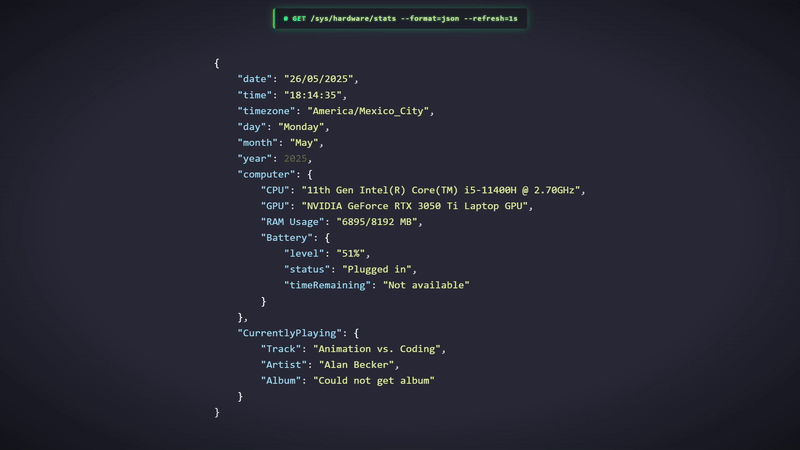

# 🌟 Lively Wallpapers Collection

 

*A collection of wallpapers I've made for [Lively Wallpaper](https://github.com/rocksdanister/lively)*

---

## 🎨 About This Collection

I've always loved the customization, creating grub themes for linux, playing with linux plymouth boot animations, trying to create wallpapers, playing with window's customization like cursors, icons for apps and folders, sounds...

And now I'm trying to create interactive live wallpapers too using lively wallpaper!
A pretty cool tool that I discovered a while ago and now I wanted to create my very own wallpapers (Even if everyone just uses wallpaper engine, I don't have money, ok?)

So yeah, feel free to check them out, fork them and learn from them to make your owns!

---

## 🖼️ Wallpaper Gallery

### 🖥️ Json System Display
*Minimalist JSON-like wallpaper that displays system information and date. Inspired by a meme I saw on reddit*

**Features:**
- 📊 Real-time system monitoring (CPU, RAM, Battery)
- 🎵 Now playing media integration
- 🎨 Very customizable colors and appearance
- 📅 Two date/time formats
- 🔧 Interactive settings panel
- 📜 Scrollable interface for different screen sizes

**[📁 View Details & Download](./Json-System-Display/)**

---

## 🚀 Quick Start

### Prerequisites
- **[Lively Wallpaper](https://github.com/rocksdanister/lively/releases)** installed

### Installation Steps
1. **Download** the wallpaper you want from the individual folders
2. **Open Lively Wallpaper**
3. **Click the '+' button** (Add Wallpaper)
4. **Drag and drop** the downloaded file or browse to select it
5. **Apply** the wallpaper to your desktop
6. **Customize** by right-clicking and selecting "Customize"

(If you are crazy enough you can just move the whole folder to lively's wallpapers folder, but I really recommend just insatlling the zip)

---

## 🛠️ Development & Customization

Each wallpaper in this collection is open-source and fully customizable! Feel free to:

- 🔧 **Fork and modify** any wallpaper to suit your needs
- 🎨 **Create your own** based on the existing code
- 🐛 **Report issues** or suggest improvements
- 🤝 **Contribute** new wallpapers to the collection

### Tech Stack
- **HTML5** - Structure and layout
- **CSS3** - Styling and animations
- **JavaScript** - Interactive functionality and system integration
- **Lively Wallpaper API** - System information and customization

---

## 📋 Coming soon
I am not going to lie, I will probably forget this after a couple wallpapers, so, no promises

*Upcoming wallpapers and features:*

- [ ] **Neofetch inspired wallpaper!** - A wallpaper to display system info (like the json one), but in a neofetch style!
- [ ] **DDLC inspired wallpaper?** - I absolutely love the game, so... maybe I'll give it a shot someday

---

## 📄 License

This project and its contained wallpapers are licensed under the Creative Commons Attribution-NonCommercial-ShareAlike 4.0 International License - see the [LICENSE](LICENSE) file for details.

Check also [this link](https://creativecommons.org/licenses/by-nc-sa/4.0/)

All wallpapers in this collection are free to use, modify, and distribute under the terms of this license.

---

## 🔗 Links

- 🏠 **[Lively Wallpaper Official](https://github.com/rocksdanister/lively)** 
- 📚 **[Lively Documentation](https://github.com/rocksdanister/lively/wiki)** 
- 💬 **[Lively Community](https://github.com/rocksdanister/lively/discussions)** 